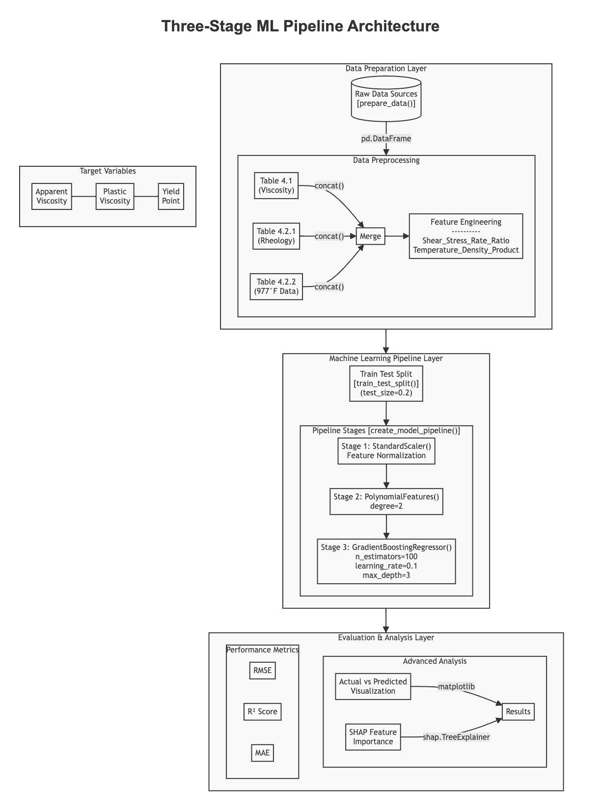
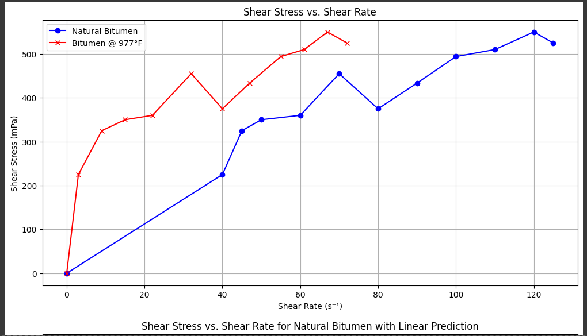
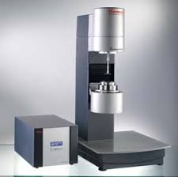

# Heavy Oil Rheology Machine Learning

## Research Overview

This research presents an innovative machine learning approach to analyze flow properties of heavy crude oil under thermal conditions, via implementing a Three-Stage Machine Learning Pipeline Ensemble with Gradient Boosting and SHAP Analysis.

## Machine Learning Pipeline Architecture



## Performance Metrics Visualization



## Experimental Device

### Haake RS 6000 Rheometer



The study utilized the Haake RS 6000 Rheometer, a sophisticated instrument for precise rheological measurements.

- **Manufacturer**: Thermo Scientific
- **Model**: Haake RS 6000
- **Key Features**: 
  - Four-bladed vane-type rotor (FL40)
  - Diameter: 40 mm
  - Gap width: 1.5 mm
  - Coaxial cylinder sensor system (Z38 DIN)
  - Sample capacity: 30.8 cm³
  - Liquid temperature-controlled system

#### Device Specifications
- **Brochure**: [Haake RS 6000 Rheometer Brochure](https://tools.thermofisher.com/content/sfs/brochures/D11480~.pdf)

## Installation

### Prerequisites
- Python 3.8+
- pip package manager

### Install from GitHub
```bash
git clone https://github.com/ol-s-cloud/heavy-oil-rheology-ml.git
cd heavy-oil-rheology-ml
pip install -r requirements.txt
```

### Install as a Package
```bash
pip install git+https://github.com/ol-s-cloud/heavy-oil-rheology-ml.git
```

## Usage

### Basic Analysis
```python
from heavy_oil_ml.pipeline import run_analysis

# Run complete analysis
results = run_analysis()
```

### Advanced Usage
```python
from heavy_oil_ml.pipeline import run_analysis
from heavy_oil_ml.visualization import plot_actual_vs_predicted, plot_shap_values

# Run analysis
results = run_analysis()

# Visualize results for each target variable
for target, result in results.items():
    plot_actual_vs_predicted(
        y_test=result['y_test'], 
        y_pred=result['y_pred'], 
        target_name=target
    )
    
    plot_shap_values(
        shap_values=result['shap_values'], 
        feature_names=result['poly_feature_names'], 
        target_name=target
    )
```

## Research Methodology

The study employs a three-stage SKLearn pipeline with Gradient Boosting and SHAP analysis to investigate thermal-induced changes in bitumen rheological properties.

### Pipeline Stages
1. **Data Preparation**: 
   - Preprocessing of viscosity and rheology data
   - Feature engineering
   - Creating derived features

2. **Machine Learning Pipeline**:
   - StandardScaler for feature normalization
   - Polynomial feature generation
   - Gradient Boosting Regression

3. **Evaluation and Analysis**:
   - Performance metrics (RMSE, R², MAE)
   - Actual vs Predicted visualization
   - SHAP feature importance analysis

## Performance Metrics

### Yield Point Prediction
- R² Score: 0.9627
- RMSE: 30.5390 Pa
- MAE: 27.7179 Pa

### Apparent Viscosity Prediction
- R² Score: 0.8428
- RMSE: 2.1546 Pa·s
- MAE: 1.6650 Pa·s

## Development Roadmap v0.1.0 (Current)

### Completed
- [x] Research and initial machine learning pipeline development
- [x] Experimental data collection and preprocessing
- [x] Machine learning model training and evaluation
- [x] Performance metrics and SHAP analysis

### Planned Features
- [ ] Develop portable machine learning model
- [ ] Create data preprocessing scripts
- [ ] Implement SHAP analysis toolkit
- [ ] Develop basic CLI interface
- [ ] Design responsive web application

## Contributions

We welcome contributions from researchers, students, and professionals across various disciplines. Here are seven key ways to contribute:

1. **Research and Scientific Advancement**
   - Propose novel machine learning approaches
   - Develop advanced feature engineering techniques
   - Validate and extend current methodological frameworks
   - Contribute domain-specific insights from petroleum engineering

2. **Code and Software Development**
   - Improve existing machine learning models
   - Enhance data preprocessing and cleaning scripts
   - Develop new visualization and analysis tools
   - Optimize computational performance
   - Implement additional machine learning algorithms

3. **Data Collection and Curation**
   - Share rheological datasets from different sources
   - Help standardize data collection methodologies
   - Develop data augmentation strategies
   - Create comprehensive metadata documentation
   - Validate and clean existing datasets

4. **Testing and Validation**
   - Develop comprehensive unit and integration tests
   - Create test suites for different scenarios
   - Validate model performance across various conditions
   - Identify and document edge cases
   - Improve error handling and logging mechanisms

5. **Documentation and Knowledge Sharing**
   - Improve code and API documentation
   - Create detailed tutorials and usage guides
   - Develop comprehensive README and user manuals
   - Write technical blog posts and articles
   - Translate documentation into multiple languages

6. **Community and Outreach**
   - Participate in code reviews
   - Help triage and reproduce reported issues
   - Engage in project discussions and roadmap planning
   - Organize workshops and webinars
   - Mentor new contributors
   - Promote the project in academic and professional networks

7. **Interdisciplinary Collaboration**
   - Bridge machine learning with petroleum engineering
   - Explore applications in related fields
   - Develop cross-domain research proposals
   - Facilitate knowledge exchange between disciplines
   - Identify potential research funding opportunities

Please read our [CONTRIBUTING.md](CONTRIBUTING.md) for detailed guidelines and [CODE_OF_CONDUCT.md](CODE_OF_CONDUCT.md) for our community standards.

## Further Reading

### Recommended Publications
1. Martinez-Palou, R., et al. (2011). "Transportation of heavy and extra-heavy crude oil by pipeline: a review." Journal of Petroleum Science and Engineering, 75(3-4), 274-282.

2. Henaut, I., et al. (2003). "Thermal flow properties of heavy oils." Offshore Technology Conference.

3. Saniere, A., et al. (2004). "Pipeline transportation of heavy oils, a strategic, economic and technological challenge." Oil Gas Science and Technology, 59(6), 455-466.

### Related Research Areas
- Non-Newtonian fluid dynamics
- Machine learning in petroleum engineering
- Thermal recovery techniques for heavy oils
- Advanced rheological modeling

## Future Research Directions
- Implement Bayesian inference for parameter uncertainty
- Explore physics-informed neural networks (PINNs)
- Develop advanced feature engineering techniques
- Implement online learning algorithms
- Integrate wavelet transformations for time-series analysis

## Publication Details
- **Title**: Three-Stage Machine Learning Pipeline Ensemble with Gradient Boosting and SHAP Analysis
- **Authors**: Falade, A.A., Sa'id, O., Akinsete, O.O
- **Journal**: Global Journal of Engineering and Technology (GJET)
- **Volume**: 4, Issue 1
- **Date**: January 2025

## License
MIT License. See the LICENSE file for complete details.

## Citation
Falade, A.A., Sa'id, O., Akinsete, O.O. (2025). Three-Stage Machine Learning Pipeline Ensemble with Gradient Boosting and SHAP Analysis. Global Journal of Engineering and Technology, 4(1), 16-25.
