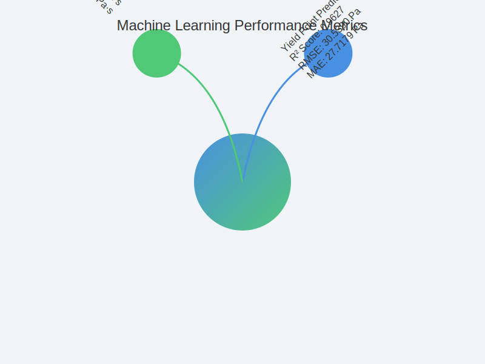

# Heavy Oil Rheology Machine Learning

## Research Overview

This research presents an innovative machine learning approach to analyze flow properties of heavy crude oil under thermal conditions, focusing on the Agbabu bitumen deposit in Ondo State, Nigeria.

## Machine Learning Pipeline Architecture

## Performance Metrics Visualization

### Performance Metrics Brain Network

## Experimental Device

[Rest of the README remains the same as in the previous version]